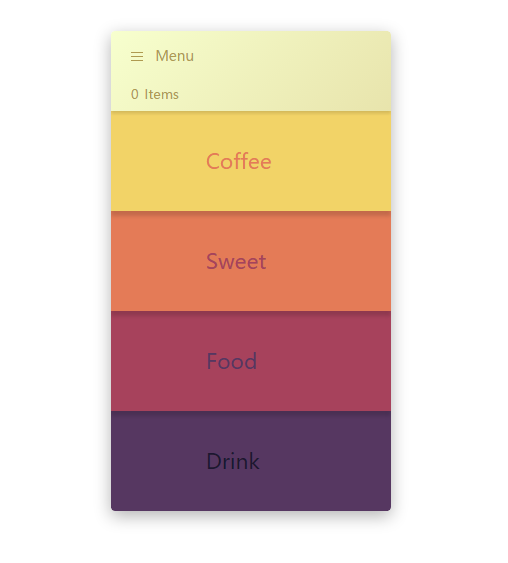
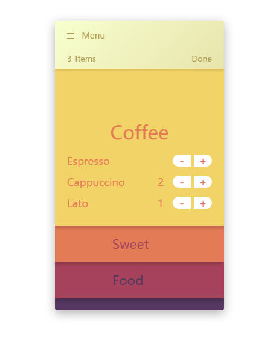
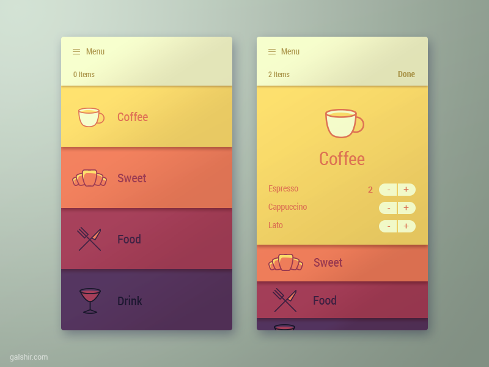

# Menu_app

这是一个移动端点菜界面

<a href="https://hannah-water.github.io/Menu_app/menu_app/menu_app.html">Menu app</a>

界面设计是Dribbble上设计师Gal Shir的一个设计 

地址：https://dribbble.com/shots/2240183-Menu-App-Interface

初始页面：

点单时：

最终实现效果：

